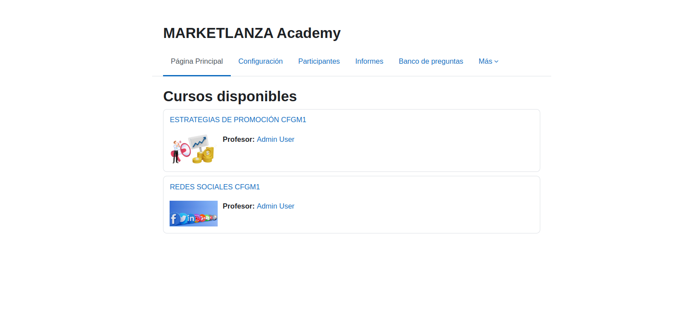

<h1>Curso Moodle Airam</h1>
En este moodle he creado un curso online de Marketing Digital básico

<h3>Instalación:</h3>

git clone https://github.com/Airamgarcia/moodleairamfinal.git

sudo docker-compose up -d

admin/Admin0101*

